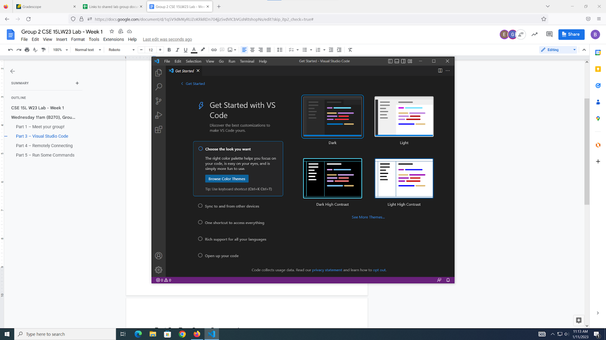
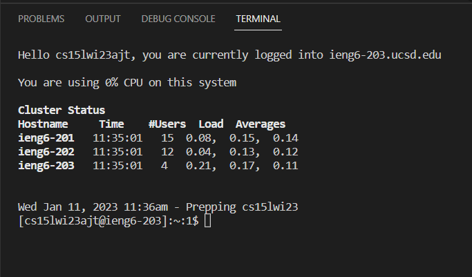
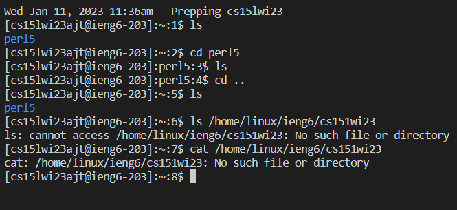
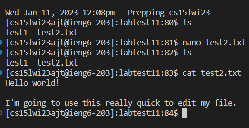

Installing:

VS Code was already installed on the ThinkVision lab desktop, and I have it on my PC at home. To download it, search it on Google and follow the download link on the VS Code website.

Remotely connecting took a while because I needed to wait for my new password to update. To log in, pull up the terminal in VS Code and enter the folliwng:

ssh cs15lwi23XX@ieng6.ucsd.edu

XX is your specific account ID. To find the account ID, set a password at this link:

https://sdacs.ucsd.edu/~icc/index.php

After your password updates, logging in is as simple as entering the ssh login ID and your password.

Once I had logged in, I tried out some commands. ls, pwd, and cd .. are very useful in order to understand where you are in the directory. Without using them frequently, it is possible to get lost.

With the remaining time I had in lab, I decided to use some slightly more advanced commands to create and edit a file. I used the nano command for the editing interface and the cat command to read the file.

