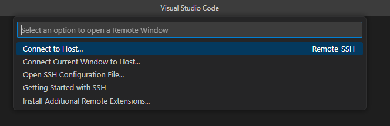
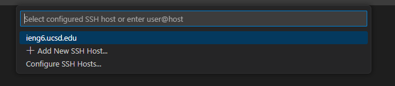
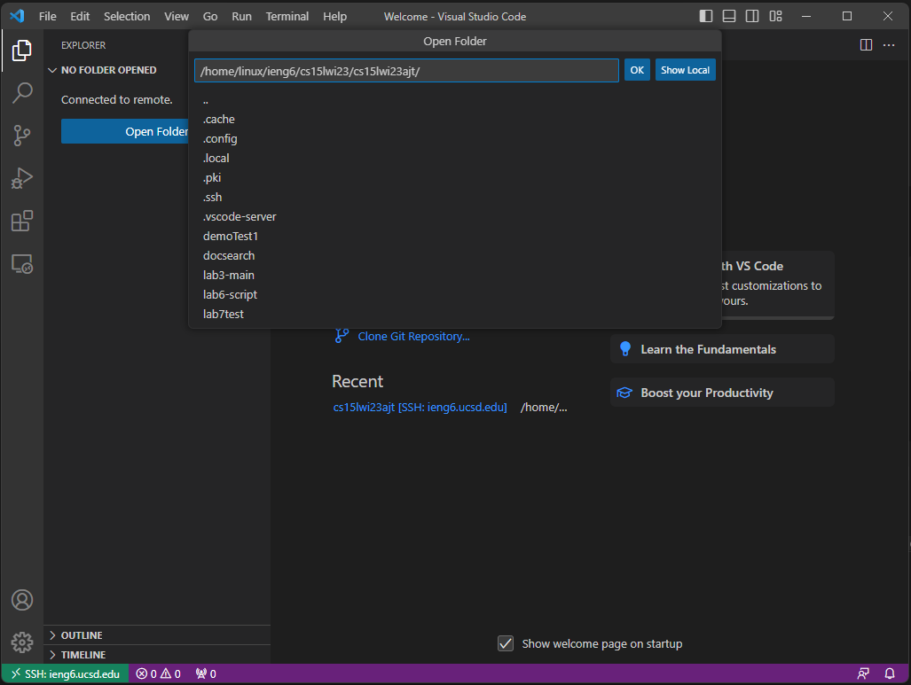
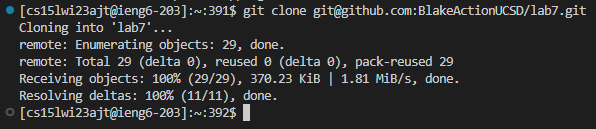

Step 4:

I used the remote ssh extension in VSC to connect to the host server with a key.



Keys: <left_click><left_click>

After selecting "Connect to Host", I clicked "ieng6.ucsd.edu" from the drop down menu.



Keys: <left_click>

From here, I was able to choose a directory to open with VSC's file explorer. I clicked "Open Folder", then "OK" to get into my directory.



Keys: <left_click><left_click>

Step 5:

Once in the directory, I opened an integrated terminal, typed out "git clone git@github.com:BlakeActionUCSD/lab7.git" and ran the command.
The ssh key was copied directly from my Github repository.



```Keys pressed: <left_click>git clone <left_click><ctrl + C><left_click><ctrl + V><enter>
  
The git clone is typed out, and the git@github.com:BlakeActionUCSD/lab7.git link is copied and pasted from the website.```
  
Step 6:

asd
