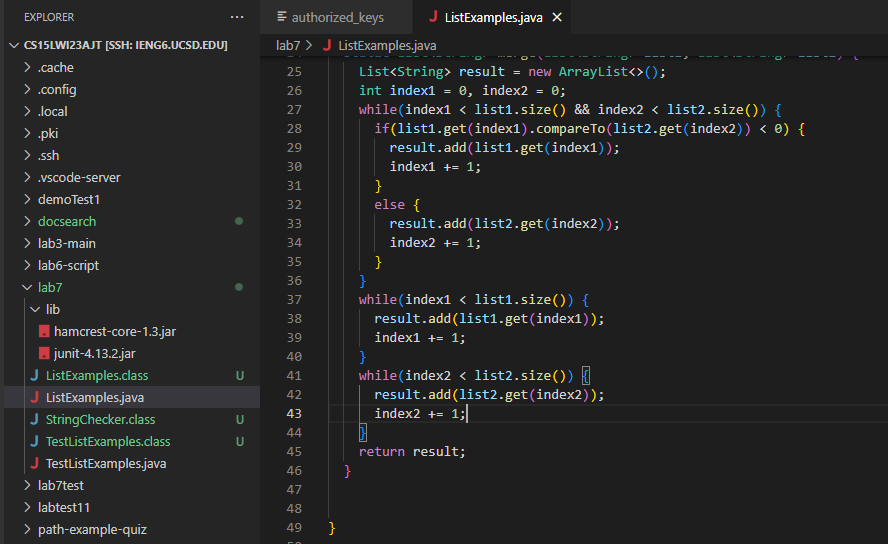
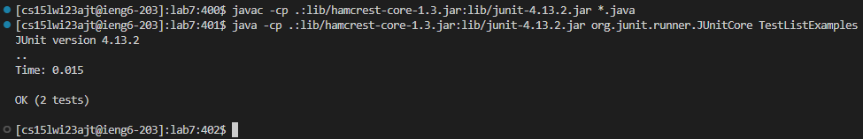
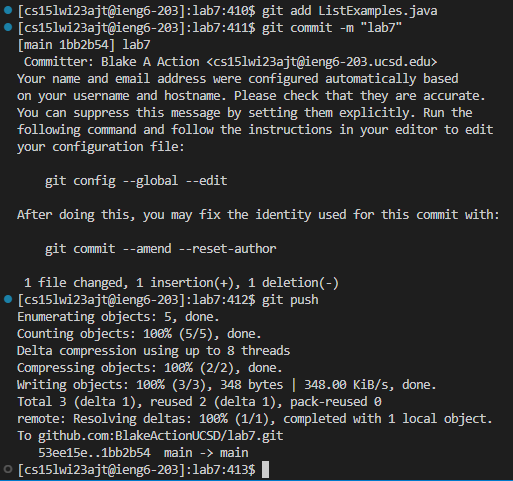
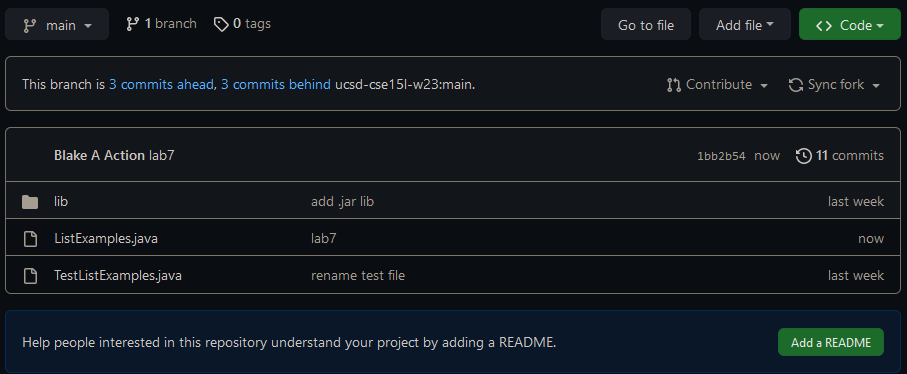
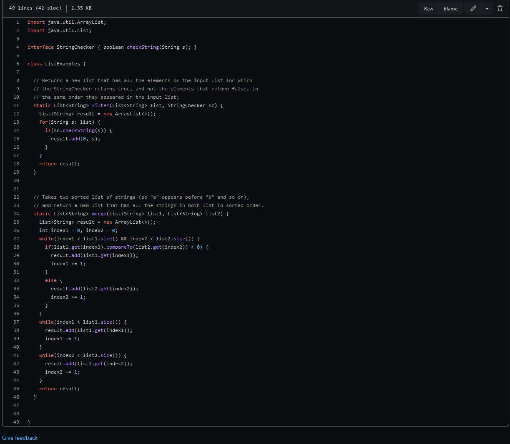

Step 4:

I used the remote ssh extension in VSC to connect to the host server with a key.


```<left_click><left_click>```

After selecting "Connect to Host", I clicked "ieng6.ucsd.edu" from the drop down menu.


```<left_click>```

From here, I was able to choose a directory to open with VSC's file explorer. I clicked "Open Folder", then "OK" to get into my directory.


```<left_click><left_click>```

Step 5:

Once in the directory, I opened an integrated terminal, typed out "git clone git@github.com:BlakeActionUCSD/lab7.git" and ran the command.
The ssh key was copied directly from my Github repository.


```<right_click><left_click>git clone <left_click><ctrl + C><left_click><ctrl + V><enter>```

Step 6:

First, I created a new itegrated terminal for the lab7 directory.


```<right_click><left_click>```

I copied the Mac junit files from a separate text file and pasted them into the terminal. At the end of junit run command, I added the class "TestListExamples".


```<ctrl + C><ctrl + V><enter>, <ctrl + C><ctrl + V> TestListExamples <enter>```

Step 7:

I changed went the ListExamples.java file via the explorer and changed index1 in the final while loop to index2, then saved the file.




```<left_click><left_click><backspace> 2 <ctrl + S>```

Step 8:

Run the same junit tests again, this time with the up arrow instead of copy/paste.



```<up><up><enter>, <up><up><enter>```

Step 9:

I used three command lines to upload the new ListExamples.java file to my repository. git add to select ListExamples.java, git commit -m "" to
commit the file and add a short message, and git push to push the update to the server.



```git add ListExamples.java <enter>```
```git commit -m "lab7" <enter>```
```git push```

Finally, I went to my repository to verify that the files were updated correctly.



